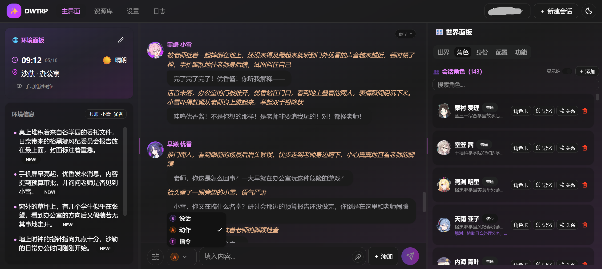
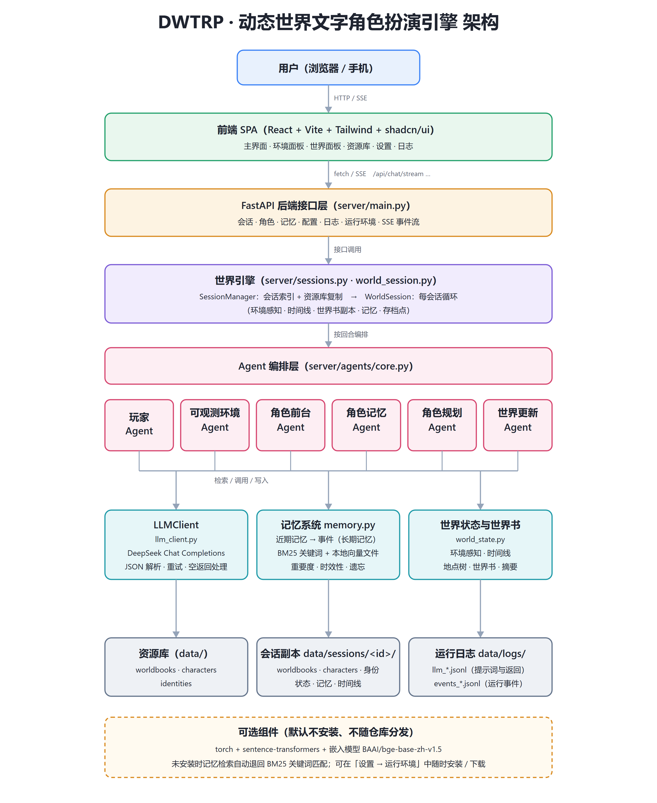

# TRPE · 动态世界文字角色扮演引擎

**Text Role-Playing Engine(TRPE)** —— 一个以玩家为核心、多 Agent 协作的动态世界文字角色扮演引擎。

*A player-centric, multi-agent collaborative dynamic-world text role-playing engine.*

它不像传统聊天机器人那样只做「一问一答」，而是让多个专门化的 Agent 共同维护一个持续运转的世界，角色有各自的记忆与规划，环境会随时间和玩家行为变化，宏观世界在后台自动推进。

## 主界面



---

## 目录

- [核心特性](#核心特性)
- [快速开始](#快速开始)
- [可选组件：向量检索与嵌入模型](#可选组件向量检索与嵌入模型)
- [配置 API Key](#配置-api-key)
- [界面功能](#界面功能)
- [角色记忆与规划](#角色记忆与规划)
- [角色卡与世界书](#角色卡与世界书)
- [目录结构](#目录结构)
- [手机 / 平板访问](#手机--平板访问)
- [日志与排查](#日志与排查)
- [技术栈](#技术栈)
- [已知问题](#已知问题)

---

## 核心特性

和 SillyTavern（酒馆）这类「单角色对话」工具不同，本项目更注重**多人世界的模拟**。

#### 多 Agent 协作的世界模拟

| Agent | 职责 | 调用时机 |
| --- | --- | --- |
| **Player Agent** | 根据当前情况、角色规划等信息，按顺序决定本回合需要做出反应的角色，并给出剧情大致走向 | 每回合 |
| **Environment Agent** | 根据Player Agent和当回合行动角色的输出，动态维护玩家附近的环境（时间 / 天气 / 地点 / 环境细节），尽可能保证世界一致性 | 每回合 |
| **Frontend Agent** | 前台角色扮演；多个角色时串行执行，先调用角色的动作与说话会进入后调用角色的上下文 | 0 ~ N 次 / 回合 |
| **Character Memory Agent** | 依据角色这段时间的经历总结长期记忆，并顺带判断性格 / 关系变化 | 世界时间到达更新点或手动更新 |
| **Character Plan Agent** | 依据新的记忆为角色规划下一时间段要做什么 | 同上 |
| **World Update Agent** | 依据辅助更新信息、角色更新与世界时间线，输出「上次更新 → 现在」的社会 / 自然变化，推进宏观世界 | 同上 |

此外还有若干辅助任务：会话初始化、AI 帮写 / 重写、故事模式、近期记忆总结等

世界/角色更新采用**两阶段**设计：先在后台线程生成更新结果（此期间前台仍可继续对话），
生成完毕后才短暂加锁写回数据，因此长时间的后台更新不会卡住你的输入

#### 多角色支持

场景原生支持多角色交互，由 Player Agent 统一调度；同时通过多种筛选条件压缩 Player Agent 的上下文（只列出「可能与本回合玩家交互」的角色），把 Token 消耗维持在可接受范围。

#### 信息可视化渲染

- **精准模式**：强制角色分别输出 思考 / 动作 / 说话（AI 帮写同样遵守），并按不同风格渲染，提升可读性。
  玩家消息也可在普通模式与精准模式之间切换，并支持自定义渲染样式。
- **环境面板**（桌面端在左栏，移动端在顶部）：直观展示玩家当前所处的时间、天气、地点与环境细节，
  每回合随剧情更新，并给变化项打上 `NEW!` 角标，有利于维护世界一致性的同时，让玩家可以依据环境信息进行下一步行动

#### 易于控制的世界

- **世界指令**：可在任意时刻插入多条指令，控制剧情走向或世界变化。
- **输入框里的「指令」**：会被转成**仅本回合生效**的一次性世界指令（换地点、指定时间流逝、点名角色等）。
- 可随时修改天气、时间等环境信息，以及世界背景与世界摘要。
- 想看角色在想什么，可打开「显示思考」；懒得打字，可用 AI 帮写；想当小说看，可开启**故事模式**，并可选择性填写指令控制故事发展（故事模式下仅 Environment Agent 每回合调用）。

#### 面向「世界模拟」的优化

- 各 Agent 的提示词做了**前缀稳定化**处理，把长期不变的内容放在前面以提高 KV Cache 命中率。
- 角色分为「核心角色」与「普通角色」，可配置「仅为核心角色生成长期记忆与规划」「玩家角色信息详细度」等，显著降低 Token 消耗。
- 支持随时把角色加入 / 移出世界，便于剧情中新角色的登场与旧角色的退场。
- 尽可能并行化：记忆总结、世界更新、角色更新都在后台执行，仅在写数据时短暂加锁。

---

## 快速开始

#### 环境要求

要运行此项目：

1. 需要预先安装Python（≥ 3.11），且保证将Python路径加入环境变量
2. 需要有DeepSeek API Key

| 组件 | 版本要求 | 是否必需 | 说明 |
| --- | --- | --- | --- |
| **Python** | **≥ 3.11** | ✅ 必需 | 后端与引擎（用到标准库 `tomllib`） |
| **DeepSeek API Key** | — | ✅ 必需 | 目前仅支持 DeepSeek API，用于所有 LLM 调用 |
| **Node.js** | ≥ 20.19 | ⬜ 可选 | 只有在修改 / 重新构建前端时才需要；仓库已带构建好的 `web/dist` |
| **torch + sentence-transformers** | — | ⬜ 可选 | 向量检索（语义记忆）；不装则用 BM25 关键词检索 |
| **嵌入模型** `BAAI/bge-base-zh-v1.5` | 约 400 MB | ⬜ 可选 | 首次使用向量检索前下载一次，**不随仓库分发** |

磁盘占用：只装必需依赖约 200 MB；再装 torch 视平台约 1 ~ 3 GB；嵌入模型约 400 MB。

#### 首次使用

1. **准备环境**：Windows 双击 `setup.bat`（macOS / Linux 运行 `./setup.sh`）。
   它会创建 `.venv`、安装必需依赖，并询问是否安装向量检索的可选组件。
2. **填 API Key**：启动后进入「设置 → 连接 / 高级」，填入 DeepSeek API Key。
3. **新建会话**：在「主界面 / 资源库」里新建会话——选择世界书、角色与玩家身份，
   填写开场提示，确认初始化预览后即可开始。

> 首次启动**没有默认会话**，需要自己新建一个（仓库自带的《蔚蓝档案》世界书与角色卡，仅作为演示模板）。

#### Windows：一键准备 + 启动

```bat
setup.bat     :: 创建 .venv、安装必需依赖，并询问是否安装向量检索的依赖与模型
start.bat     :: 启动后端并自动打开浏览器（必要时先构建前端）
```

`start.bat` 会依次寻找解释器：环境变量 `TRPE_PYTHON` → 项目内 `.venv` → `py -3` → `PATH` 中的 `python`。也就是说：**只要你已经有一个 Python ≥ 3.11 的环境，把它指给 `TRPE_PYTHON` 就能直接启动**，不需要再建虚拟环境：

```bat
set TRPE_PYTHON=D:\Python\.venv\Scripts\python.exe
start.bat
```

#### macOS / Linux

```bash
./setup.sh    # 等价于 python3 scripts/setup_env.py
./start.sh
```

#### 手动方式

```bash
python -m pip install -r requirements.txt
python server/main.py            # 默认 http://127.0.0.1:8000
python server/main.py --host 0.0.0.0 --port 8000   # 允许局域网 / 手机访问
python server/main.py --mock     # 离线模式：不调用 LLM，用于验证界面与接口
```

前端已随仓库提供构建产物（`web/dist`，由后端直接托管），因此**普通使用不需要 Node.js**。只有修改前端代码时才需要：

```bash
cd web
npm install
npm run build        # 产物输出到 web/dist
npm run dev          # 前端热更新开发（把 /api 代理到 http://127.0.0.1:8000）
```

#### 环境准备脚本

`scripts/setup_env.py` 是跨平台的准备脚本，`setup.bat` / `setup.sh` 只是它的薄封装：

```bash
python scripts/setup_env.py --check                 # 只检查环境，不做改动
python scripts/setup_env.py                         # 建 .venv + 装必需依赖（交互询问可选组件）
python scripts/setup_env.py --yes                   # 非交互：只装必需依赖
python scripts/setup_env.py --embedding --download-model    # 连向量检索一起装好
python scripts/setup_env.py --pip-index https://pypi.tuna.tsinghua.edu.cn/simple
```

---

## 可选组件：向量检索与嵌入模型

**必需依赖只有 `requirements.txt`**（FastAPI + BM25 关键词检索）。向量检索依赖的`torch`、`sentence-transformers` 与嵌入模型体积很大，因此**默认不随项目分发**，在准备环境时会询问是否需要：

```
向量检索（语义记忆）需要额外的 torch + sentence-transformers（数百 MB ~ 数 GB）
与嵌入模型（约 400 MB）。不安装也能正常使用，记忆检索会用 BM25 关键词匹配；
之后随时可以在「设置 → 运行环境」里补装。
是否现在安装向量检索的依赖与模型？ [y/N]
```

**不安装：** 长期记忆仍然照常写入、检索与遗忘，只是相关性打分只用BM25 关键词（+ 重要度 + 时效性），不再有语义相似度。界面上会显示当前模式是「仅 BM25 关键词」。

**之后想补装（三种方式任选）：**

1. **设置 → 运行环境**：可查看「Python 版本 / 依赖是否安装 / 模型是否已缓存」，并一键「安装嵌入依赖」「下载嵌入模型」，进度与日志实时显示；还能在此开关向量检索、填写 pip 源与 HuggingFace 镜像。
2. **重新运行准备脚本**：`python scripts/setup_env.py --embedding --download-model`
3. **手动命令**：

   ```bash
   python -m pip install -r requirements-embedding.txt      # 可选依赖
   python scripts/fetch_embedding_model.py                  # 下载嵌入模型
   python scripts/fetch_embedding_model.py --endpoint https://hf-mirror.com   # 国内镜像
   ```

> **国内网络**：下载模型建议使用镜像 `https://hf-mirror.com`（可在「设置 → 运行环境」里填写，或给命令加 `--endpoint`）。
> 
>**N 卡加速**（可选）：`python -m pip install --index-url https://download.pytorch.org/whl/cu129 torch`，之后再 `pip install -r requirements-embedding.txt`。仅在 CPU 上跑也完全可用。

模型文件保存在 HuggingFace 缓存目录（`HF_HOME` 或 `~/.cache/huggingface`）。服务端默认以**离线方式**加载本地缓存中的模型，避免网络受限时反复重试导致「卡在正在回应」；对应的配置项是 `config.toml` 的 `[embedding] offline`。

相关配置（也可在设置界面修改）：

```toml
[embedding]
enabled = true        # 关闭后即使装了 torch 也只用 BM25
offline = true        # 只从本地缓存加载，不联网
model_name = "BAAI/bge-base-zh-v1.5"	# 默认嵌入模型
dim = 768

[env]
pip_args = []         # 安装可选依赖时的额外 pip 参数
pip_index_url = ""    # 例如 https://pypi.tuna.tsinghua.edu.cn/simple
hf_endpoint = ""      # 例如 https://hf-mirror.com
```

---

## 配置 API Key

首次使用需要在**设置 → 连接 / 高级**里填入 DeepSeek API Key（保存在 `server/.env`），也可以手动编辑该文件（可从 `server/.env.example` 复制）：

```ini
DEEPSEEK_API_KEY=sk-xxxxxxxxxxxxxxxx
```

还可以直接设置环境变量：`$env:DEEPSEEK_API_KEY = "sk-..."`（Windows）/ `export DEEPSEEK_API_KEY=sk-...`。

> 没有 Key 时后端仍可启动、可浏览界面，但对话、更新与记忆总结会提示「未找到 API Key」。
> 
>未配置 Key 时界面会明确提醒：顶部出现琥珀色警示条，顶栏「设置」与「设置 → 连接 / 高级」均带感叹号标记，输入框上方也会提示「未配置 API Key，无法发送」，点击即可跳到填写处。
> 
> 目前仅支持 **DeepSeek API**（走 OpenAI 兼容的 Chat Completions 接口）。

---

## 界面功能

顶部是导航栏，主界面是其中一个板块：

- **主界面**：底部输入栏 + 三栏布局（左环境 / 中 历史记录 / 右世界面板），左右栏宽度可拖拽调整。
  - 左栏（玩家感知）：当前时间、天气（图标随天气变化）、地点、环境备注，变化项带 `NEW!` 角标。
  - 中栏（Story）：历史交流与行动，流式渲染。动作用 *斜体*，说话用「」气泡，角色思考默认隐藏。
  - 右栏（世界面板）：**记忆**（容量条、事件统计、重要度走势、增删事件）、**角色表**、**玩家身份**、
    **世界信息**（逐本查看 / 编辑世界书、世界摘要、时间线）、**会话配置**等。
- **资源库**：管理世界书、角色卡（支持搜索与标签）、玩家身份卡三大模板库，可下载模板文件。
- **设置**：引擎参数、提示词、运行环境、个性化、连接 / 高级（API Key 与原生 JSON 配置）。
- **日志**：查看每个 Agent 的完整提示词、模型原始返回，以及关键运行事件（可按 agent / 事件类型筛选、搜索）。
- 左侧（移动端为顶部下拉）是**会话栏**：新建、切换、删除会话。

玩家消息支持「说 / 做」分段输入与精准模式切换；「令」段会转成本回合的世界指令。

---

## 角色记忆与规划

#### 记忆的生成与检索

- **近期事件（工作记忆）**：对话过程中按「时间 / 地点 / 天气 / 环境变化」逐条累积在会话内；超过 `working_memory_limit` 后，把靠前的部分交给 LLM 总结成一条条**事件**。
- **长期记忆（事件）**：事件是长期记忆的唯一单位（一段值得记住的总结 + 重要度 + 时间）
- **向量存本地文件**：每个角色的记忆向量保存在 `server/data/sessions/<id>/memory/<角色id>.vec.pkl`，检索时直接读文件算余弦相似度，不依赖数据库存储。
- **检索打分**：`相关性（向量相似度 + BM25 关键词）+ 重要度 + 时效性` 加权排序，取 Top 事件拼进角色上下文。没有安装嵌入模型时，相关性退化为纯 BM25。
- **多轮检索（可选）**：把 `[memory] agentic_retrieval` 设为 `true` 后，角色前台作答前可以先规划检索——改写检索词、查看指定 id 的事件，最多补 `max_retrieval_rounds` 轮。
- 默认**仅核心角色**生成长期记忆与规划，可在「设置 → 引擎参数」或会话配置里修改。

#### 遗忘机制

按时效性与重要度对长期记忆打分，超过 `max_events` 后淘汰得分最低的记忆。

#### 角色规划

角色规划（`Character Plan Agent`）会依据最新总结出的记忆，为角色生成**下一时间段**要做的事，
每条包含 `时间 / 地点 / 行动 / 是否与玩家相关`，可以有多条且首尾相接；规划会进入 Player Agent 与 Frontend Agent 的上下文，让角色的行动更有连续性。

---

## 角色卡与世界书

角色卡与世界书均以 JSON 存储。为了特色功能的实现，本项目的角色卡与世界书与 SillyTavern **不兼容**，字段规范见`docs/std_data.md`；**资源库**UI界面里可以下载模板文件：

- `templates/character_card.template.json`
- `templates/worldbook.template.json`

字段分三类：

| 类别 | 说明 |
| --- | --- |
| **必需字段** | 如角色卡的 `name` / `intro`、世界书的 `name` / `overview`；缺失会导致导入失败 |
| **推荐字段** | 如角色卡的 `surname` / `relationships` / `speech_style`、世界书的 `locations` / `entries`；缺失也能用 |
| **自定义字段** | 仅角色卡中存在，自定义字段不会被解析，而是**原样拼接**进 Frontend Agent 的上下文 |

新建会话时会把所选的世界书、角色卡、身份卡**复制**进会话目录，之后的修改只影响该会话，
因此多个会话可以共用同一套模板而各自演进。

---

## 目录结构

```text
TRPE/
├── README.md                     # 本文档
├── docs/
│   ├── architecture.png          # 系统架构图
│   └── architecture.svg          # 架构图源文件（可自行修改后重新导出）
│   └── std_data.md               # 数据字段说明
├── requirements.txt              # 必需依赖（后端 + BM25）
├── requirements-embedding.txt    # 可选依赖（torch + sentence-transformers）
├── setup.bat / start.bat         # Windows 一键准备 / 启动
├── setup.sh  / start.sh          # macOS / Linux
├── scripts/
│   ├── setup_env.py              # 环境准备（建 venv、装依赖、可选装向量检索）
│   ├── fetch_embedding_model.py  # 下载嵌入模型（支持 HuggingFace 镜像）
│   └── check_frontend.py         # 判断前端是否需要重新构建
├── server/                       # Python 后端（引擎 + FastAPI 接口）
│   ├── main.py                   # 后端入口：python server/main.py
│   ├── config.toml               # 配置（世界 / 记忆 / 各 Agent / 嵌入 / 服务）
│   ├── settings.py               # 配置加载（含 server/.env）
│   ├── embedding.py              # 嵌入模型（可选依赖，缺失时自动降级到 BM25）
│   ├── env_manager.py            # 运行环境检测 / 安装 / 模型下载
│   ├── memory.py                 # 长期记忆：事件 + 向量文件 + BM25 + 遗忘
│   ├── agents/core.py            # 各 Agent 的提示词与解析
│   ├── world_session.py          # 单个会话的世界循环（状态 / 时间线 / 更新）
│   ├── sessions.py               # 会话管理（索引、复制资源、存档点）
│   └── data/                     # 数据目录（资源库 + 每个会话的运行时数据）
│       ├── characters/           # 角色卡资源库
│       ├── worldbooks/           # 世界书资源库
│       ├── identities/           # 玩家身份卡资源库
│       ├── sessions/<id>/        # 会话副本与运行时状态（记忆 / 状态 / 时间线）
│       └── logs/                 # LLM 调用日志与运行事件日志
└── web/                          # React 前端（Vite + Tailwind + shadcn/ui）
    ├── src/                      # 组件、状态管理、API 客户端
    └── dist/                     # 构建产物（已随仓库提供，由后端托管）
```

数据都在 `server/data/`：资源库（世界书 / 角色卡 / 身份卡）是全局模板，`sessions/<id>/` 是每个会话的副本与运行时数据，`logs/` 是调用日志。

---

## 移动端访问

后端默认监听 `0.0.0.0`。手机与电脑连同一个 Wi-Fi 后，用浏览器打开
`http://<电脑局域网IP>:8000` 即可（IP 可在「设置 → 个性化 → 📱 手机远程」里直接查看并复制）。

移动端UI做了部分适配：世界面板默认隐藏为底部抽屉，环境面板在上半屏、对话在下半屏（中间可拖动分隔条），顶部导航可横向滑动。「📱 手机远程」卡片在**手机端**还提供「关闭电脑」按钮
（30 秒倒计时，可取消；仅 Windows可用）。

> 嵌入模型需要 torch，不方便直接在手机上运行，因此移动端采用「PC 作服务端 + 手机浏览器访问」的方式。

---

## 日志与排查

每次 LLM 调用都会记录**完整提示词（system + user）与模型原始返回 / 解析结果**：

```text
server/data/logs/llm_YYYY-MM-DD.jsonl      # 每次 LLM 调用
server/data/logs/events_YYYY-MM-DD.jsonl   # 关键运行事件（非 LLM 调用）
```

日志界面支持按 agent / 事件类型（`player`、`world_update`、`memory_summary`、`turn_done` …）筛选与内容搜索，提示词与原始返回默认折叠。

如果出现「环境在变化，但角色没有调用」，按顺序检查：

1. Player Agent 返回的 `invoke` 里是否真的有角色，如果没有角色，则模型判断此回合没有角色需要回复；
2. 是否有 `unknown_character`（模型用了中文名但角色卡存的是 id——本项目支持 id / 中文名双向解析）；
3. 是否有 `frontend_failed` 或 `memory_context_failed`（例如嵌入模型缺失，此时会降级为「暂无相关记忆」，不会卡住对话）；
4. `llm_*.jsonl` 里对应 agent 的 `raw` 是否是含 `sequence` 的合法 JSON。

日志默认只保留最近若干天（`config.toml` 的 `[logs] retention_days`）。

---

## 技术栈



| 层 | 技术 |
| --- | --- |
| 前端 | React 19 · Vite · TypeScript · Tailwind CSS · shadcn/ui（base-ui）· zustand · recharts |
| 后端 | Python 3.11+ · FastAPI · uvicorn · SSE 流式接口 |
| 记忆 | rank-bm25 · jieba · numpy（向量检索为可选的 sentence-transformers） |
| 模型 | DeepSeek Chat（OpenAI 兼容）· 可选本地嵌入 `BAAI/bge-base-zh-v1.5` |
| 存储 | JSON 文件（资源库 / 会话副本 / 状态 / 时间线 / 日志）+ 本地向量文件 |

---

## 已知问题

- 由于需要Player Agent对角色行为进行调度（且该Agent默认开启low思考），回复延迟略有增加，尤其是在还没有kvcache时
- 项目的时空一致性仍无法完全保证，人物关系网也不够完善（角色之间可能「不认识」或搞错对方背景）。
- Chrome 深色模式会影响部分界面的可见度；移动端 UI 仍可能出现小问题。
- 「重写 / 回溯」之后的消息编辑等功能可能存在问题。
- 世界模拟本质上是低精度拟合：要精确模拟需要像 *《Generative Agents: Interactive Simulacra of Human Behaviuor》* 那样对全部角色做全时段规划与模拟，几乎无法实时运行、Token 消耗也过大；本项目在精度与可用性之间做了折中（角色分核心 / 普通、不实时模拟所有角色、选择性对角色生成记忆与规划、规划被打断后也不立即更新）。
- 有些数据改动后需要等到下一回合才会更新显示。
- 多次连续使用「故事模式」，将导致环境、角色等不会更新，进而影响世界一致性。
- 同一个角色每天的规划可能出现高度相似的问题，多样性较差。

---

## 版本历程

1. 基本的小说 RAG
2. 树状记忆结构：针对信息的长距离依赖问题
3. 角色扮演、记忆的构建和遗忘
4. 「世界」的构建：多 Agent 协作
5. UI 交互：从命令行到GUI
6. 运行时优化：前缀稳定化、精简提示词、尽可能并行更新
7. 功能优化与 BUG 修复

---

## 其它

- 代码以 [MIT License](LICENSE) 开源。
- 项目主体代码由 DeepSeek-V4-Flash 与 DeepSeek-V4-Flash-Vision-Exp 完成。
- 仓库默认附带《蔚蓝档案》的世界书与主要角色卡（由网络资料整理），**仅用于演示**，版权归原方所有；
  若要发布自己的作品，请替换为自有数据。
